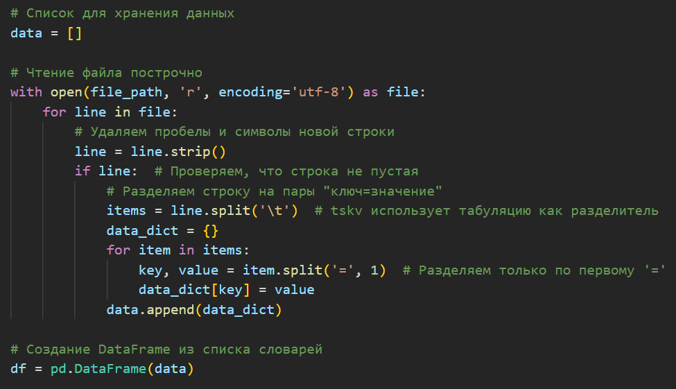
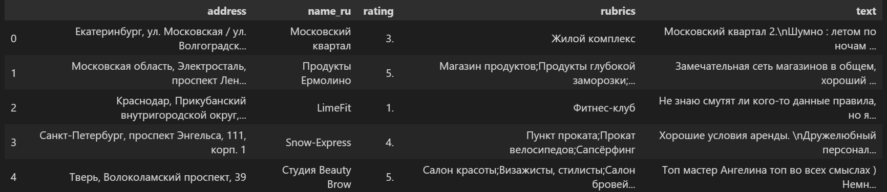
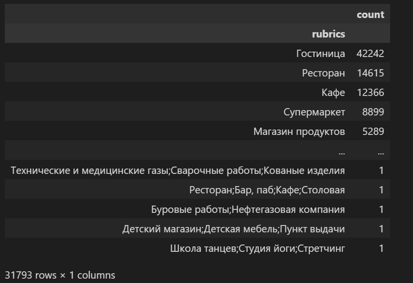
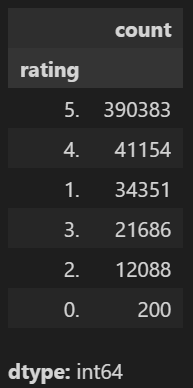
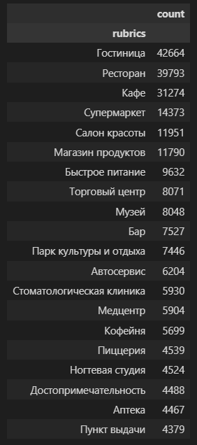

# Проектный практикум 3. Учебная задача

## Цель:

Создать нейронную сеть, способную генерировать текстовые отзывы о различных местах на основе определенных входных параметров, таких как:
- категория места
- средний рейтинг 
- ключевые слова

## Команда №2 (УрФУ):
1. Баканов Максим
2. Анастасия Толстолуцкая
3. Андрей Ларионов
4. Артур Миронов
5. Дашков Артем
6. Кочнев Кирилл

## План реализации задачи

### 1. Проведение очистки данных
Выполняется чтение и обработка текстового файла, формат которого предполагает разделение данных табуляцией, 
а каждая отдельная запись в строке соответствует паре "ключ=значение". 
Затем данные преобразуются в DataFrame.

Как результат:

 
### 2. Анализ данных

Анализ рубрик:

Разделение рубрик по разделителю и создание новых строк:

Далее произведен поиск и удаление дубликатов.

Анализ распределения целевых классов:

В результате анализа определено количество уникальных наименований организаций: 148442 и количество уникальных адресов организаций: 191869. 
Таким обрзаом можно сделать вывод, что некоторые организации работают по нескольким адресам. По каждому адресу могут быть различные отзывы потребителей.

Ниже представлено распределение количества отзывов по категориям мест:

Отзывы потребители в основном оставляют в сферах гостиничных услуг, общественного питания, торговли, индустрии красоты.

### 3. Фильтрация данных на основе вводных параметров

### 4. Создание отзыва о месте на основе существующих отзывов