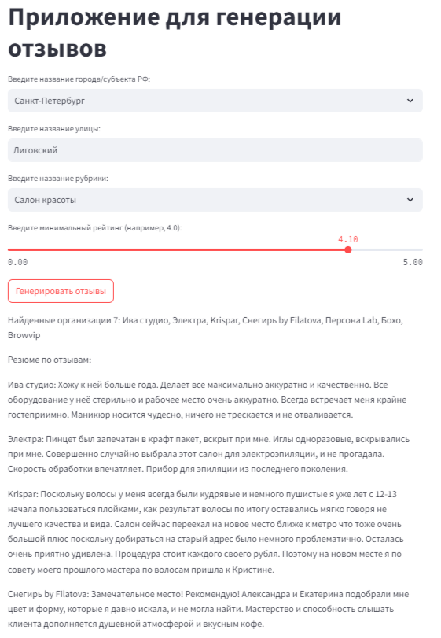

# Проектный практикум 3. Учебная задача

## Команда №2 (УрФУ):
1. Баканов Максим
2. Анастасия Толстолуцкая
3. Андрей Ларионов
4. Артур Миронов
5. Дашков Артем
6. Кочнев Кирилл

## Цель:

Создать нейронную сеть, способную генерировать текстовые отзывы о различных местах на основе определенных входных параметров, таких как:
- категория места
- средний рейтинг 
- ключевые слова

## Реализация задачи

### 1. Проведение очистки данных
Выполняется чтение и обработка текстового файла, формат которого предполагает разделение данных табуляцией, 
а каждая отдельная запись в строке соответствует паре "ключ=значение". 
Затем данные преобразуются в DataFrame.
 
### 2. Анализ данных

Проведен анализ рубрик, их разделение рубрик по разделителю и создание новых строк:
Далее произведен поиск и удаление дубликатов.
В результате анализа определено количество уникальных наименований организаций: 148442 и количество уникальных адресов организаций: 191869. 
Таким обрзаом можно сделать вывод, что некоторые организации работают по нескольким адресам. По каждому адресу могут быть различные отзывы потребителей.
Отзывы потребители в основном оставляют в сферах гостиничных услуг, общественного питания, торговли, индустрии красоты.

### 3. Предобработка текстов отзывов для тестирования моделей

Убрали из текста эмодзи, лишние пробелы. 
Сохранены знаки препинания, заглавные буквы, так как это может способствовать повышению качества модели суммаризации текста.

### 4. Обучение модели суммаризации текста

Выделены следующие характеристики параметров модели:
- sentences: это входные данные для обучения, представляющие собой список списков токенов (слов). Каждый внутренний список соответствует одному предложению.
- vector_size: Размерность векторов, представляющих слова. Например, vector_size=100 означает, что каждое слово будет представлено вектором размерности 100. Увеличение этого значения может помочь захватить больше информации о семантике слов, поэтому попробуем несколько значения этого параметра.
- window: Максимальное расстояние между текущим словом и словами вокруг него. Например, window=5 означает, что модель будет учитывать до 5 слов слева и 5 слов справа от текущего слова. Увеличение этого значения может помочь модели лучше понимать контекст. Также попробуем обучить модель на разных значениях этого параметра.
- min_count: Минимальное количество раз, которое слово должно встречаться в корпусе, чтобы оно было включено в модель. Например, min_count=1 включает все слова. Увеличение этого значения может помочь избавиться от редких слов и уменьшить размер словаря.
- workers: Количество потоков для параллельной обработки данных. Значение по умолчанию — 1. Поскольку по каждой организации не много отзывов оставим этот параметр по умолчанию.
- sg: Определяет алгоритм обучения: если sg=0, используется CBOW (Continuous Bag of Words), если sg=1, используется Skip-Gram. CBOW быстрее обучается на больших объемах данных, но Skip-Gram лучше справляется с редкими словами.

### Общие выводы по проекту

Как итог работы получается приложение, позволяющее генерировать отзывы для выбранного места:

Пример сгенерированных отзывов:

В проекте применена классическая экстрактивная модель суммаризации текстов отзывов о поставщиках.
При разных параметрах модель по разному суммаризует тексты, что говорит о ее работоспособности.
Вместе с тем применение современных генеративных моделей - GPT, Perplexity дали бы лучший результат суммаризации.
